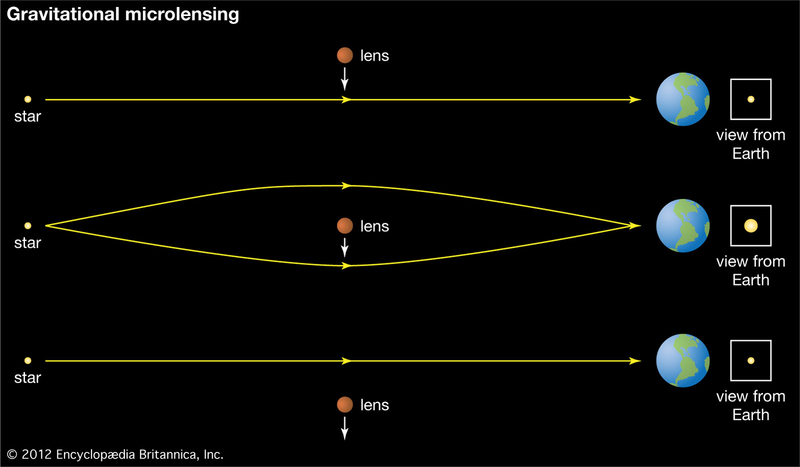

## Gravitational Microlensing
 

Gravitational lensing is a physical phenomenon described in 
 Einstein's theory [General Relativity](https://en.wikipedia.org/wiki/General_relativity)
in which massive objects bend space around them which in turn causes light 
passing close to the object to change its direction of propagation.
If we are *extremely* lucky, it's possible to observe this phenomenon with
single stars in our Galaxy acting as both the light sources and the massive
objects (usually called lenses) which cause the bending of light.
We cannot *see* this effect, called *gravitational microlensing* directly, 
but we can see the apparent change in brightness of a background star in 
our galaxy due to a foreground object passing in front of it. The foregorund
object is usually also a star, but it can be a planet, a 
[Brown Dwarf](https://en.wikipedia.org/wiki/Brown_dwarf), or even a [Black
Hole](https://en.wikipedia.org/wiki/Black_hole). 
The massive object acts as a lens causing a magnifying effect which is 
greatest when the background light source and the foreground object are 
perfectly aligned with respect to an observer on Earth.

If we are even more lucky, the foreground object will be a star with a 
orbiting around it, and the planet will also bend light in such a way that
we can detect its presence. Gravitational microlensing is thus a method
of detecting [exoplanets](https://en.wikipedia.org/wiki/Exoplanet). In 
particular, it is currently the only method sensitive to detecting cool 
planets orbiting close to the 
[snow line](https://en.wikipedia.org/wiki/Frost_line_(astrophysics)) 
which are similar to planets in our own Solar System.

The main focus of my research is developing novel, mostly
[Bayesian](http://tuvalu.santafe.edu/~simon/br.pdf) for modeling microlensing
events. 
From a statical viewpoint, microlensing data consists of multiple time series data 
called light curves, sampled at uneven time intervals.
The number of observatories 
participating in the observations of a single event can be as high as a dozen, often 
involving both ground and space based facilities.
The model for these events consists of a probabilistic noise model and a deterministic
physical model, 
where the latter is very challenging to deal with because it is highly non-linear 
and there are always multiple 
physical "solutions" for a given light curve, leading to multi-modal and highly 
correlated posterior probability distributions.
These pose a significant challenge to even the most 
[sophisticated sampling methods](http://arogozhnikov.github.io/2016/12/19/markov_chain_monte_carlo.html) 
which routinely fail in such circumstances. 
In addition to  the sampling issues, quantifying the evidence for a planet in a 
microlensing event is equally challenging.

## Evolving stars and circumbinary planets

