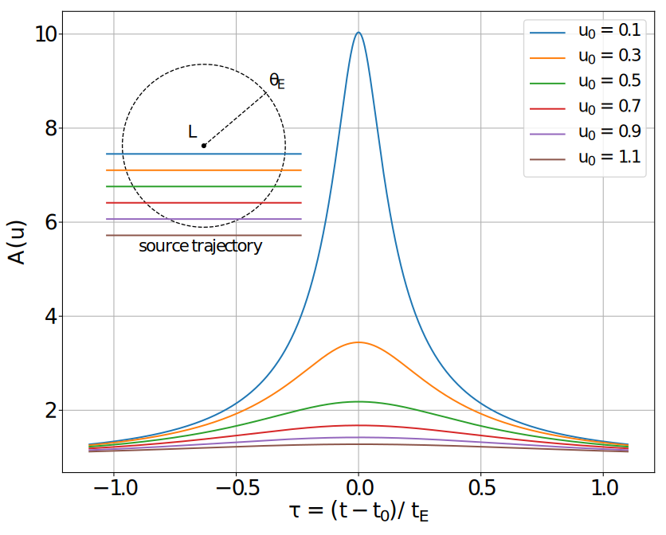
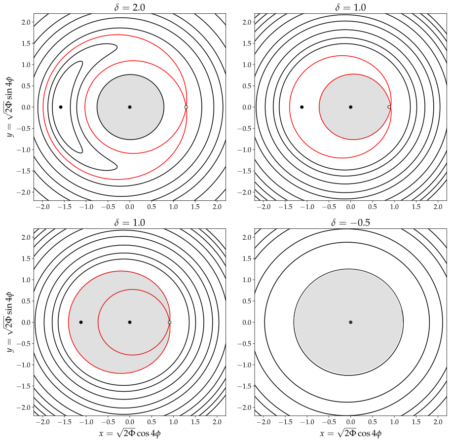

## Gravitational Microlensing

  
  <figcaption>Short animation illustrating a gravitational microlensing event, source
  <a href="https://www.youtube.com/watch?v=yY9w_LQ7WHc">here</a>.</figcaption>

Gravitational lensing is a physical phenomenon described in 
 Einstein's theory [General Relativity](https://en.wikipedia.org/wiki/General_relativity).
General Relativity predicts that massive objects such as stars and Black Holes
bend space around them, 
which in turn causes light passing close to such objects to 
get deflected slightly towards the massive object.
This means that if we observe a given star in our galaxy, 
and a faint massive object passes directly in front of it from 
our point of view, the star will appear
brighter than usual for certain time period because the massive object
acts as a *lens*. The magnifying effect is 
greatest when the background light source and the foreground object are 
perfectly aligned with respect to an observer on Earth and it is called
[gravitational microlensing](https://en.wikipedia.org/wiki/Gravitational_microlensing).

Gravitational microlensing events are extraordinarily rare, they are quite literally
*one in a million* events. 
This means that either we have to be
very lucky to observe one, or we have to continuously monitor hundreds 
of millions of stars in our galaxy hoping that a few will get magnified for
a short period in time.
The reason why this effect is useful, besides being another demonstration
of Einstein's theory, is that it enables us to say something about the 
massive object which acts as a lens in a microlensing event.
The lensing object is just another star in the vast majority of 
events, but it can also be a
[Brown Dwarf](https://en.wikipedia.org/wiki/Brown_dwarf), a 
[Neutron Star](https://en.wikipedia.org/wiki/Neutron_star) or a [Black
Hole](https://en.wikipedia.org/wiki/Black_hole). 

  
  <figcaption>Magnification of a point light source due to point mass 
  lensing object as a function of time.</figcaption>

In a small subset of the already rare microlensing evnets, 
it is possible to detect planets orbiting around the lensing star.
In those cases, the planets themselves act as magnifying lenses, enabling us 
to detect their presence without observing them directly. 
Gravitational microlensing is thus a method
for detecting [exoplanets](https://en.wikipedia.org/wiki/Exoplanet). In 
particular, it is currently the only method sensitive to detecting cool 
planets similar to planets in our own Solar System, orbiting close to the
so called 
[snow line](https://en.wikipedia.org/wiki/Frost_line_(astrophysics)).

The main focus of my research is developing novel, mostly
[Bayesian](http://tuvalu.santafe.edu/~simon/br.pdf) for modeling microlensing
events. 
Although the physics behind microlensing is understood very well, 
the inverse problem of infering the model parameters given 
observed data is very difficult.
From a statical viewpoint, microlensing data consists of multiple time series 
sampled at uneven time intervals representing brightness measurements of stars.
The number of observatories 
participating in the observations of a single microlensing event can 
be as high as a dozen, often 
involving both ground and space based facilities.

The statistical model for these events consists of a probabilistic 
noise model and a deterministic physical model. The latter is very challenging to deal with because it is highly non-linear 
and there are almost always multiple physical systems which give rise to near 
identical data.
This results in multi-modal and highly correlated posterior 
probability distributions, posing a significant challenge to 
even the most 
[sophisticated sampling methods](http://arogozhnikov.github.io/2016/12/19/markov_chain_monte_carlo.html) 
which routinely fail in such circumstances. 
In addition to  the sampling issues, quantifying the evidence for a planet in a 
microlensing event and distinguishing the signal from the noise 
is equally challenging.

## Evolving stars and circumbinary exoplanets

  
  <figcaption>Tatooine, the original circumbinary planet.</figcaption>

When the original *Star Wars* film aired in 1977 planets orbiting around
two stars such were purely fictional objects.
Today, thanks to the [Kepler](https://en.wikipedia.org/wiki/Kepler_space_telescope) 
space telescope we know that not only do these planets exist, but they are 
also [common](https://arxiv.org/abs/1404.5617).
These planets are called [circumbinary planets](https://en.wikipedia.org/wiki/Circumbinary_planet)
because they are orbiting [binary stars](https://en.wikipedia.org/wiki/Binary_star).
Since the gravitational interaction between the two stars is strong compared to the
gravity between a single star and a planet,
circumbinary planets have to orbit sufficiently far out from the two stars to avoid
being ejected from the system or engulfed by one of the stars.

In my master's thesis, I researched what happens to such planets as one of 
the two stars in the binary evolves and becomes a 
[Red Giant](https://en.wikipedia.org/wiki/Red_giant) star.
When a star in a binary system becomes a Red Giant, its size increases by several 
orders of magnitude and it often engulfs the other star in the system in the process.
To answer what happens to the planets orbiting around, such evolving binary stars,
I developed an analytical model of the interaction between
the binary star and the outer planets using 
[Hamiltonian mechanics](https://en.wikipedia.org/wiki/Hamiltonian_mechanics), 
and also ran computer simulations directly simulating the gravitational interactions
between the planets and the binary using
the N-BODY code [REBOUND](https://rebound.readthedocs.io/en/latest/).
My master's thesis is available for download 
[here](https://zir.nsk.hr/en/islandora/object/phyri%3A38).

  
  <figcaption>Phase space plots of a Hamiltonian system 
  describing an interaction between
     a circumbinary planet and a binary star.</figcaption>

