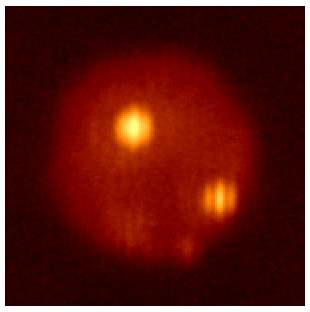
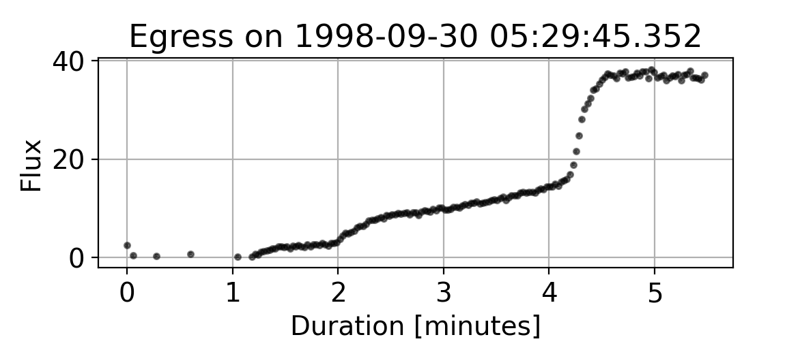
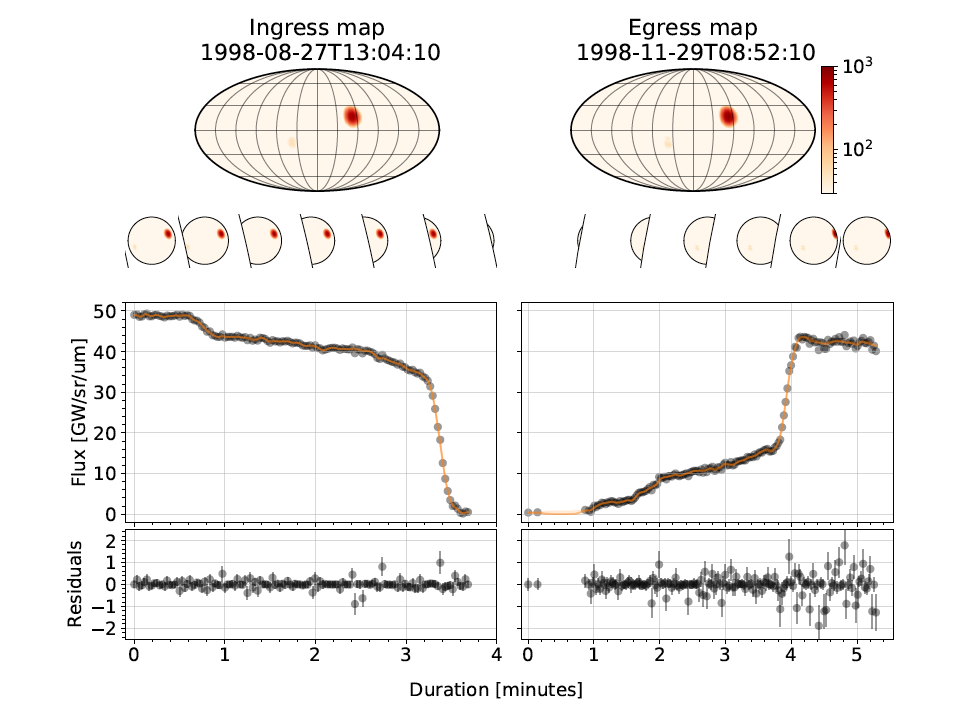

## Gravitational Microlensing

  
  <figcaption>Short animation illustrating a gravitational microlensing event. 
  <a href="https://www.youtube.com/watch?v=yY9w_LQ7WHc">Source</a>.</figcaption>

Gravitational lensing is a physical phenomenon described in 
 Einstein's theory of [General Relativity](https://en.wikipedia.org/wiki/General_relativity).
General Relativity predicts that massive objects such as stars and Black Holes
bend space in their vicinity which in turn causes light passing close to such objects to 
get deflected slightly towards them.
This means that if we observe a given star in our galaxy, 
and a faint massive object passes directly in front of it from 
our point of view, the star will appear
brighter than usual for a certain time period because the massive object
acts as a kind of *lens*. The magnifying effect is 
greatest when the background light source and the foreground object are 
perfectly aligned with respect to an observer on Earth and it is called
[gravitational microlensing](https://en.wikipedia.org/wiki/Gravitational_microlensing).

A gravitational microlensing event is extraordinarily rare, it is quite literally a *one in a million* event.
This means that either we have to be extremely lucky to observe one by looking at a particular star or we can continuously observe hundreds of millions of stars in our galaxy hoping that few will get magnified for a short period in time.
The latter startegy is of course used in practice.
The reason why this effect is useful, besides being another proof that Einstein's theory make correct predictions, is that it enables us to learn something about the massive object which acts as a lens in a microlensing event.
In the majority of microlensing events the lensing object is just another star but ocassionally it can be a [Brown Dwarf](https://en.wikipedia.org/wiki/Brown_dwarf), a [Neutron Star](https://en.wikipedia.org/wiki/Neutron_star) or a [Black Hole](https://en.wikipedia.org/wiki/Black_hole). 

  
  <figcaption>Magnification of a point light source due to point mass 
  lensing object as a function of time.</figcaption>

For a small subset of microlensing evnets it is possible to detect planets orbiting around the lensing star.
In those cases, the planets themselves act as magnifying lenses enabling us to detect their presence without observing them directly. 
This makes it possible to use the microlensing effect to detect [exoplanets](https://en.wikipedia.org/wiki/Exoplanet). 
Microlensing is currently the only method sensitive to detecting cool planets similar to planets in our own Solar System, orbiting close to the so called [snow line](https://en.wikipedia.org/wiki/Frost_line_(astrophysics)).

The main focus of my research is developing novel, mostly [Bayesian](http://tuvalu.santafe.edu/~simon/br.pdf) methods for modeling microlensing events. 
Although the physics behind microlensing is understood very well, the inverse problem of infering the parameters of the physical model given observed data is very difficult.
From a statical viewpoint, microlensing data consists of multiple time series sampled at uneven time intervals representing brightness measurements of stars.
The highly nonlinear and near pathological nature of the microlensing mapping results in posterior probability distributions (out beliefs of the physics given observed data) which are very difficult to characterize using even the most [sophisticated inference algorithms](http://arogozhnikov.github.io/2016/12/19/markov_chain_monte_carlo.html) which routinely fail in such circumstances. 

In my work, I build [code](https://github.com/fbartolic/caustic) for modeling these events using probabilistic programming frameworks [PyMC3](https://github.com/pymc-devs/pymc3) and [numpyro](https://github.com/pyro-ppl/numpyro).
These frameworks enable the use of [automatic differentiation](https://jax.readthedocs.io/en/latest/notebooks/autodiff_cookbook.html) for computing fast and exact (up to machine precision) gradients of the likelihood with respect to all model parameters.
Knowning the gradients speeds up inference by orders of magnitude because gradients provide information on the [geometry](https://arxiv.org/abs/1701.02434) of the parameter space which makes it a lot easier for MCMC samplers to known in which direction to move in a high dimensional space.
In addition to working on improving the efficiency of modeling microlensing events, I am interested in questions on how to choose suitable priors, how to sample multi-modal posteriors, how to decide between competing models and how to pool information from hundreds of different events in a hierarchical way to constraint properties of *populations of lenses*.

## Mapping the surfaces of planets and moons within and outside of our Solar System

In astronomy we can only resolve the surfaces of a few of the closest large stars using a technique called [interferometry](https://en.wikipedia.org/wiki/Astronomical_interferometer).
Directly resolving surfaces of planets and small stars is hopeless because it would require telescopes with extremely large diameters. 
Fortunately, in some specific cases there is a way around this problem. 
If we observe the total brightness of both the star and the planet to a very high precision as the planet passes behind the star in its orbit (a so called *occultation* or an *eclipse*), the surface features of the planet will be imprinted onto the time series measurements.
Thus it is in principle possible to start with the time series data and reconstruct a crude surface map of the (star facing) side of the planet. 
Amazingly, this has already been accomplished in [2007](https://arxiv.org/abs/0705.0993) using NASA's Spitzer space telescope, albeit only for a large Jupiter sized planet orbiting very close to its close star and at very low resolution.
The [resulting map](https://upload.wikimedia.org/wikipedia/commons/0/03/Global_Temperature_Map_for_Exoplanet_HD_189733b.jpg) showed a large hot spot with an Eastward shift from the star facing side of the planet.

Recently, [Rodrigo Luger](https://luger.dev/) developed a fast method called [starry](https://luger.dev/starry/latest/notebooks/Basics.html) for modeling these kinds of occultations analytically which is possible if one assumes that the surface features can be expanded in a basis of spherical harmonics. 
Together with Rodrigo and Dan Foreman-Mackey I worked on a project to apply this code to a system for which we (approximately) know the ground truth for what the surface looks like. 
We used archival near infrared observations of Jupiter's innermost moon [Io](https://en.wikipedia.org/wiki/Io_(moon)) observed at the times when Io was occulted by Jupiter.
Io is the most volcanically active body in the Solar System with multiple eruptions happening on different timescales (days to years).
It is scientifically interesting because it is a sort of model for extreme volcanism on hot exoplanets and it is in many ways similar to the early Earth.
Although multiple spacecrafts have visited Io and taken detailed images of its surface so we know what the surface looks like in visible light, in the near infrared the surface looks different at any given time depending on which volcanoes are active.
Here's video taken during an occultation of Io by Europa with the Large Binocular Telescope in the near infrared:

  
  <figcaption>An occultation of Io by Europa. Taken from <a href="https://news.berkeley.edu/2017/05/10/waves-of-lava-seen-in-ios-largest-volcanic-crater/">here</a>.</figcaption>

Four hot spots corresponding to active volcanoes are visible on Io's surface.
As Europa's projected disk sweeps across Io's surface the volcanoes disappear out of view one by one, leaving a signature in the observed total flux (not shown).
Here's what the data looks like for a similar occultation, except this time it is an occultation by Jupiter:

  
  <figcaption>An occultation of Io by Europa. Taken from <a href="https://news.berkeley.edu/2017/05/10/waves-of-lava-seen-in-ios-largest-volcanic-crater/">here</a>.</figcaption>

The occultation lasts for about 4 minutes and in this particular case we are observing Io when it is appearing behind the limb of Jupiter and hence the flux is increasing.
The data is very high quality (because Io is in the Solar System so it's easy to observe) and one can clearly see two steps in the light curve, a smaller one around 2 minutes and a major increase around 4.2 minutes. 
These steps correspond to individual volcanoes on Io's surface. 
We built a probabilistic model using Starry in order to reconstruct the locations of the hot spots of the volcanoes from a few light curves. 
Importantly, in our model we don't assume that we know the locations of the spots or how many there are, we only assume a sparse prior on the map, meaning that we expect the surface to be very hot at a few locations (major volcanoes) and cold everywhere else.
This is the map of Io we are able to infer from only two light curves:

  
  <figcaption>Median inferred map of surface thermal emission on Jupiter's moon Io. 
  Output of a probabilistic model fitted on two occultation light curves (1D time series data).</figcaption>

The model has thousands of parameters but we are able to avoid overfitting with the sparsity inducing prior and by sampling the posterior with Hamiltonian Monte Carlo. 
We also use a Gaussian Process to model residual noise in the observations which is present because of instrument deficiencies and weather (observations were taken from Earth). 
The Gaussian Process supplements the physical model and prevents it from overfitting the features in the light curve which are purely due to noise or the weather.
We find that the explanatory power of the Gaussian Process is just right, meaning that if a certain feature in the light curve can be well explained by the physical surface model, the physical model won't be outcompeted by the Gaussian Process.

## Evolving stars and circumbinary exoplanets

  
  <figcaption>Tatooine, the original circumbinary planet.</figcaption>

When the original *Star Wars* film aired in 1977 planets orbiting around [binary stars](https://en.wikipedia.org/wiki/Binary_star) were purely fictional objects.
Thanks to the [Kepler](https://en.wikipedia.org/wiki/Kepler_space_telescope) 
space telescope today we know that [circumbinary planets](https://en.wikipedia.org/wiki/Circumbinary_planet) not only exist, they are [quite common](https://arxiv.org/abs/1404.5617).

Since the gravitational binding energy between two stars is much stronger than the binding energy between a single star and a planet, circumbinary planets have to be sufficiently far away from the two stars to avoid being ejected from the system or engulfed by one of the stars.
In my master's thesis, I was interested in what happens to such planets as one of the two stars in the binary evolves and becomes a  [Red Giant](https://en.wikipedia.org/wiki/Red_giant) star, a process during which the star's size increases by several orders of magnitude.

To see what happens to the planets orbiting around the binary system containing a Red Giant I developed an analytical model of the interaction between the binary star and the outer planets using [Hamiltonian mechanics](https://en.wikipedia.org/wiki/Hamiltonian_mechanics) and I also ran computer simulations directly simulating the gravitational interactions between the planets and the binary using the N-BODY code [REBOUND](https://rebound.readthedocs.io/en/latest/).
I found that there are no easy answers to the question and that the outcome of what happens to a given system depends on specific properties of that system and the initial conditions.
My master's thesis is available for download [here](https://zir.nsk.hr/en/islandora/object/phyri%3A38).

  
  <figcaption>Phase space plots of a Hamiltonian system 
  describing an interaction between
     a circumbinary planet and a binary star.</figcaption>

