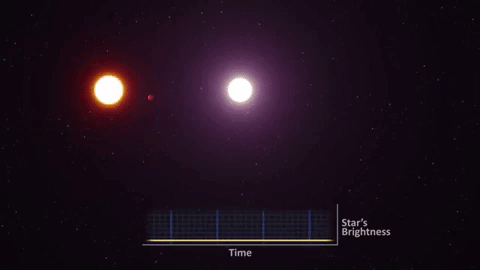

## Gravitational Microlensing
 

<figure>
  
  <figcaption>Short animation illustrating a gravitational microlensing event
  <a href="https://www.youtube.com/watch?v=yY9w_LQ7WHc">, source</a>.</figcaption>
</figure>

Gravitational lensing is a physical phenomenon described in 
 Einstein's theory [General Relativity](https://en.wikipedia.org/wiki/General_relativity).
General Relativity predicts that massive objects such as stars and Black Holes
bend space around them, 
which in turn causes light passing close to such objects to 
change direction ever so slightly towards the massive object.
This means that if we observe a given star in our galaxy, 
and a faint massive object passes directly in front of it from 
our point of view, the star will appear
brighter than usual for certain time period because the massive object
acts as a *lens*. The magnifying effect is 
greatest when the background light source and the foreground object are 
perfectly aligned with respect to an observer on Earth and it is called
[gravitational microlensing](https://en.wikipedia.org/wiki/Gravitational_microlensing).
Gravitational microlensing events are extraordinarily rare, this 
means that we either have to be
very lucky to observe one, or we have to continuously observe hundreds 
of millions of stars in our galaxy hoping that a few will get magnified for
a period in time.
The reason why this effect is useful, besides being another demonstration
of Einstein's theory, is that it enables us to say something about the 
massive lensing object which acts as a lens.
The lensing object is most commonly a star, a
[Brown Dwarf](https://en.wikipedia.org/wiki/Brown_dwarf), or even a [Black
Hole](https://en.wikipedia.org/wiki/Black_hole). 

<figure>
  
  <figcaption>Magnification of a point light source due to point mass 
  lensing object as a function of time.</figcaption>
</figure>

If we are even more lucky, the foreground object will be a star with a 
orbiting around it, and the planet will also bend light in such a way that
we can detect its presence. Gravitational microlensing is thus a method
of detecting [exoplanets](https://en.wikipedia.org/wiki/Exoplanet). In 
particular, it is currently the only method sensitive to detecting cool 
planets orbiting close to the 
[snow line](https://en.wikipedia.org/wiki/Frost_line_(astrophysics)) 
which are similar to planets in our own Solar System.

The main focus of my research is developing novel, mostly
[Bayesian](http://tuvalu.santafe.edu/~simon/br.pdf) for modeling microlensing
events. 
From a statical viewpoint, microlensing data consists of multiple time series data 
called light curves, sampled at uneven time intervals.
The number of observatories 
participating in the observations of a single event can be as high as a dozen, often 
involving both ground and space based facilities.
The model for these events consists of a probabilistic noise model and a deterministic
physical model, 
where the latter is very challenging to deal with because it is highly non-linear 
and there are always multiple 
physical "solutions" for a given light curve, leading to multi-modal and highly 
correlated posterior probability distributions.
These pose a significant challenge to even the most 
[sophisticated sampling methods](http://arogozhnikov.github.io/2016/12/19/markov_chain_monte_carlo.html) 
which routinely fail in such circumstances. 
In addition to  the sampling issues, quantifying the evidence for a planet in a 
microlensing event is equally challenging.

## Evolving stars and circumbinary planets
 

<figure>
  
  <figcaption>Tatooine, the original circumbinary planet.</figcaption>
</figure>

When the original *Star Wars* film aired in 1977 planets orbiting around
two stars such were purely fictional objects.
Today, thanks to the [Kepler](https://en.wikipedia.org/wiki/Kepler_space_telescope) 
space telescope we know that not only that these planets exist, but they are 
also [quite common](https://arxiv.org/abs/1404.5617).
These planets are called [circumbinary planets](https://en.wikipedia.org/wiki/Circumbinary_planet)
since they are orbiting [binary stars](https://en.wikipedia.org/wiki/Binary_star).
Since the gravitational interaction between the two stars is quite strong,
the planets have to orbit sufficiently far out from the two stars to avoid
being ejected from the system or engulfed by one of the stars.

In my master's thesis, I researched what happens to such planets as one of 
the two stars evolves and becomes a 
[Red Giant](https://en.wikipedia.org/wiki/Red_giant) star.
To answer this question, I developed an analytical model of the interaction between
the binary star and the outer planets using 
[Hamiltonian mechanics](https://en.wikipedia.org/wiki/Hamiltonian_mechanics), 
and also ran computer simulations 
with the N-BODY code [REBOUND](https://rebound.readthedocs.io/en/latest/).
My master's thesis is available for download 
[here](https://zir.nsk.hr/en/islandora/object/phyri%3A38).
 

<figure>
  
  <figcaption>Phase plots of a Hamiltonian system describing an interaction between
     a circumbinary planet and a binary star.</figcaption>
</figure>

